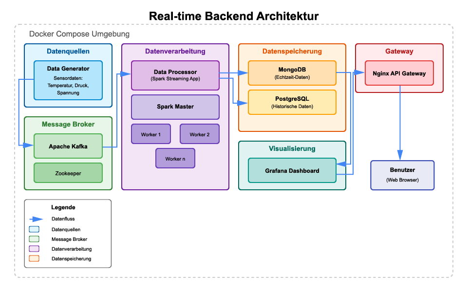

# Real-time Backend für datenintensive Applikationen

Dieses Projekt implementiert ein skalierbares, zuverlässiges und wartbares Echtzeit-Backend zur Verarbeitung großer Datenmengen. Die Architektur basiert auf Microservices und verwendet moderne Stream-Processing-Technologien, um kontinuierlich Sensordaten zu erfassen, zu verarbeiten und für Analysen bereitzustellen.

## Überblick

Das System besteht aus folgenden Hauptkomponenten:

- **Datengenerierung**: Simuliert Sensordaten für Temperatur, Druck und Spannung
- **Apache Kafka**: Message Broker für Datenstrom-Management
- **Apache Spark Streaming**: Echtzeit-Datenverarbeitung und -Aggregation
- **TimescaleDB (PostgreSQL)**: Optimierte Zeitreihendatenbank für Datenspeicherung
- **Grafana & Prometheus**: Monitoring und Visualisierung
- **Nginx**: API-Gateway und Zugriffssteuerung

Die Daten fließen durch die Pipeline: Generator → Kafka → Spark → TimescaleDB und können über Grafana-Dashboards visualisiert werden.

## Architekturdiagramm



*Hinweis zur Implementierung:* Die im ursprünglichen Konzept vorgesehene MongoDB wurde durch TimescaleDB (PostgeSQL + TimescaleDB-Extension) ersetzt. Diese Entscheidung wurde aus zwei Gründen getroffen:

1. **Bessere Grafana-Integration**: TimescaleDB bietet eine nahtlose Integration mit Grafana, während MongoDB Kompatibilitätsprobleme aufwies, die zusätzliche Konfigurationen erfordert hätten.
2. **Optimierung für Zeitreihen**: TimescaleDB ist speziell für Zeitreihendaten optimiert und kann sowohl Echtzeit- als auch historische Daten effizient verwalten, wodurch die Notwendigkeit einer zweiten Datenbank entfiel.

Zusätzlich wurde Prometheus als Monitoring-Lösung implementiert, was nicht im ursprünglichen Plan enthalten war. Diese Entscheidung bietet folgende Vorteile:

1. **Umfassendes Systemmonitoring**: Prometheus ermöglicht die Überwachung aller Systemkomponenten mit minimalem Aufwand.
2. **Integration mit Grafana**: Durch die Kombination von Prometheus und Grafana konnte ein einheitliches Monitoring-Dashboard für alle Aspekte des Systems erstellt werden.

## Systemanforderungen

- Docker (Version 20.10+)
- Docker Compose (Version 2.0+)
- Mindestens 8 GB RAM
- Etwa 5 GB freier Festplattenspeicher
- Eine stabile Internetverbindung für den initialen Download der Images

## Installation und Setup

### 1. Repository klonen

```bash
git clone https://github.com/jurkat/realtime-backend.git
cd realtime-backend
```

### 2. Hosts-Konfiguration

Fügen Sie folgende Einträge zu Ihrer Hosts-Datei hinzu:
- Unter Linux/macOS: `/etc/hosts`
- Unter Windows: `C:\Windows\System32\drivers\etc\hosts`

```
127.0.0.1   metrics.localhost
127.0.0.1   spark.localhost
127.0.0.1   worker-1.localhost
127.0.0.1   worker-2.localhost
127.0.0.1   worker-3.localhost
127.0.0.1   processor.localhost
127.0.0.1   kafka.localhost
127.0.0.1   prometheus.localhost
```

Diese Konfiguration ist notwendig, damit die URLs der einzelnen Dienste korrekt aufgelöst werden können.

### 3. Verzeichnisstruktur vorbereiten

Das System benötigt ein Verzeichnis für gemeinsam genutzte Daten. Erstellen Sie dieses mit:

```bash
mkdir -p data-files
```

### 4. Konfiguration anpassen (optional)

Die Standard-Konfiguration ist für eine lokale Testumgebung optimiert. Für spezifische Anforderungen können Sie folgende Dateien anpassen:

- `docker-compose.yml`: Hauptkonfiguration der Dienste
- `docker-compose.override.yml`: Entwicklungsspezifische Überschreibungen
- `services/*/Dockerfile`: Container-Definitionen
- `services/timescaledb/init-timescaledb.sql`: Datenbank-Schema

## Starten des Systems

### Produktionsumgebung
```bash
./start-production.sh
```

Alternativ mit nativen Docker Compose Befehlen:
```bash
docker compose -f docker-compose.yml -f docker-compose.monitoring.yml up -d --build
```

### Entwicklungsumgebung
```bash
./start-debug.sh
```

Alternativ mit nativen Docker Compose Befehlen:
```bash
docker compose -f docker-compose.yml -f docker-compose.override.yml up -d --build
```

### System stoppen
```bash
./stop-all.sh
```

Alternativ mit nativen Docker Compose Befehlen:
```bash
# Für Produktionsumgebung
docker compose -f docker-compose.yml -f docker-compose.monitoring.yml down -v

# Für Entwicklungsumgebung
docker compose -f docker-compose.yml -f docker-compose.override.yml down -v
```

## Verfügbare Services (Produktionsumgebung)

Alle Services (außer Grafana) verwenden Basic Auth:
- Username: admin
- Password: admin

- **Grafana**: https://metrics.localhost (Login in Grafana: admin/admin)
- **Spark Master**: https://spark.localhost
- **Spark Worker 1**: https://worker-1.localhost
- **Spark Worker 2**: https://worker-2.localhost
- **Spark Worker 3**: https://worker-3.localhost
- **Data Processor**: https://processor.localhost
- **Kafka UI**: https://kafka.localhost
- **Prometheus**: https://prometheus.localhost

## End-to-End Tests

1. Starten Sie die Produktionsumgebung:
```bash
./start-production.sh
```

2. Führen Sie die Tests aus:
```bash
./e2e-test.sh
```

Dieser Test überprüft:
- Ob alle Container laufen
- Die Kafka-Konnektivität
- Die Spark-Datenverarbeitung
- Die Datenspeicherung in TimescaleDB
- Die Anomalieerkennung

Ausführliche Informationen zu den Tests finden Sie in der [Test-Dokumentation](docs/e2e-test-dokumentation.md).

## Architektur und Datenfluss

### Sensordatengenerierung

Der `data-generator`-Dienst simuliert Sensordaten mit folgenden Eigenschaften:
- Drei Sensortypen: Temperatur (°C), Druck (hPa), Spannung (V)
- Zufällige Werte innerhalb realistischer Bereiche
- ISO-formatierte Zeitstempel
- Kontinuierliche Generierung mit einstellbarem Intervall (Standard: 200ms)
- Erzeugt ca. 900 Messungen pro Minute (15 pro Sekunde)
- Bei dieser Rate würden 1.000.000 Datenpunkte in etwa 18,5 Stunden erreicht

### Datenverarbeitung

Der `data-processor`-Dienst verwendet Spark Streaming, um:
- Daten aus Kafka zu lesen
- Anomalien zu erkennen (z.B. ungewöhnlich hohe Temperaturen)
- Echtzeit-Aggregationen zu berechnen (Minuten, 10-Minuten, Stunden)
- Angereicherte Daten in TimescaleDB zu speichern

### Datenspeicherung

Die Datenbank-Struktur in TimescaleDB umfasst:
- Tabellen für Echtzeit-Messungen
- Separate Tabelle für erkannte Anomalien
- Zeitskalierte Hypertables für effiziente Zeitreihenabfragen
- Automatische Komprimierung und Aufbewahrungsrichtlinien

### Monitoring und Visualisierung

Das System bietet umfassende Monitoring-Funktionen:
- **System-Infrastruktur-Dashboards**: Echtzeit-Überwachung von CPU, Speicher, Festplatten und Netzwerkaktivität aller Dienste
- **Datenverarbeitungs-Dashboards**: Visualisierung von Durchsatz, Verarbeitungszeiten und erkannten Anomalien
- **Kafka-Monitoring**: Überwachung von Topics, Partitionen, Consumer-Gruppen und Nachrichtenverzögerungen
- **Service-Status-Übersicht**: Statusanzeigen für alle kritischen Komponenten mit automatischer Aktualisierung
- **Schwellenwert-basierte Alarme**: Farbliche Markierungen und Warnungen bei Überschreitung kritischer Werte

Die Dashboards sind über Grafana unter https://metrics.localhost zugänglich (Login: admin/admin).

## Vor- und Nachteile der Architektur

### Vorteile
- **Entkopplung**: Durch die Microservice-Architektur und Kafka als Nachrichtenvermittler sind die Komponenten lose gekoppelt, was die Wartung und Skalierung einzelner Dienste ermöglicht
- **Fehlertoleranz**: Ausfälle einzelner Komponenten führen nicht zum Gesamtausfall; Nachrichten bleiben in Kafka erhalten
- **Skalierbarkeit**: Horizontale Skalierung durch Hinzufügen weiterer Worker-Knoten für Spark oder Kafka ohne Systemänderungen
- **Echtzeitfähigkeit**: Schnelle Verarbeitung großer Datenmengen durch Spark Streaming mit geringer Latenz

### Nachteile
- **Komplexität**: Mehrere verteilte Komponenten erhöhen die Komplexität bei Deployment und Betrieb
- **Ressourcenbedarf**: Das Gesamtsystem benötigt mehr Ressourcen als eine monolithische Lösung
- **Steile Lernkurve**: Erfordert Kenntnisse in verschiedenen Technologien (Kafka, Spark, TimescaleDB)
- **Overhead**: Docker-Container und Netzwerkkommunikation zwischen Diensten erzeugen zusätzlichen Overhead

## Hauptkriterien der Implementierung

### Zuverlässigkeit (Reliability)
- **Containerisierung**: Alle Dienste laufen in Docker-Containern mit automatischen Neustarts bei Ausfällen
- **Datenpersistenz**: TimescaleDB mit Volume-Mounts für persistente Datenspeicherung
- **Health Checks**: Implementierte Healthchecks in allen Containern für Statusüberwachung
- **Fehlerbehandlung**: Robuste Fehlerbehandlung im Spark-Prozessor mit detailliertem Logging

### Skalierbarkeit (Scalability)
- **Horizontale Skalierung**: Spark-Cluster mit einem Master und drei Worker-Knoten
- **Datensegmentierung**: Partitionierte Speicherung in TimescaleDB durch Hypertables
- **Effiziente Datenverarbeitung**: Aggregationen in verschiedenen Zeitfenstern reduzieren Datenmenge
- **Ressourcenisolierung**: Docker-Container mit Isolierung auf Prozess- und Netzwerkebene

### Wartbarkeit (Maintainability)
- **Microservice-Architektur**: Klare Trennung der Verantwortlichkeiten zwischen Diensten
- **Infrastructure as Code**: Vollständige Docker-Compose-Konfiguration für einfache Reproduzierbarkeit
- **Monitoring**: Umfassendes Monitoring mit Prometheus und Grafana für Fehlererkennung
- **Konsistente Logging**: Strukturiertes Logging in allen Komponenten

## Datensicherheit und Governance

Das System implementiert mehrere Sicherheits- und Governance-Maßnahmen:

- **Sicherheit**: TLS/SSL-Verschlüsselung, Basic Auth, Netzwerksegmentierung
- **Datenqualität**: Schema-Validierung, Anomalieerkennung für Sensordaten
- **Daten-Lifecycle**: Automatische Komprimierung und definierte Aufbewahrungsfristen
- **Monitoring**: Umfassendes Logging und Metriken-Erfassung durch Prometheus

Eine vollständige Beschreibung aller implementierten Maßnahmen zur Datensicherheit und Data Governance finden Sie in der [Sicherheitsdokumentation](docs/datensicherheit-governance.md).

## Fehlerbehebung

### Container starten nicht

Überprüfen Sie:
- Ob die erforderlichen Ports verfügbar sind (80, 443, 9092, 5432)
- Ob ausreichend Ressourcen (RAM, Festplattenspeicher) vorhanden sind
- Die Container-Logs mit `docker logs realtime-backend-<container_name>-1`

### Keine Daten in Grafana sichtbar

Stellen Sie sicher, dass:
- Der Datengenerator erfolgreich gestartet wurde
- Kafka-Topics korrekt erstellt wurden
- Die TimescaleDB-Verbindung zu Grafana funktioniert

## Erweiterungsmöglichkeiten

Das System kann wie folgt erweitert werden:

1. **Zusätzliche Datenquellen**: Integration weiterer Sensoren oder externer Daten
2. **Komplexere Analysen**: Implementierung von ML-Algorithmen für Anomalieerkennung
3. **Horizontale Skalierung**: Hinzufügen weiterer Kafka-Broker oder Spark-Worker
4. **Batch-Verarbeitung**: Integration einer zweiten Pipeline für historische Daten